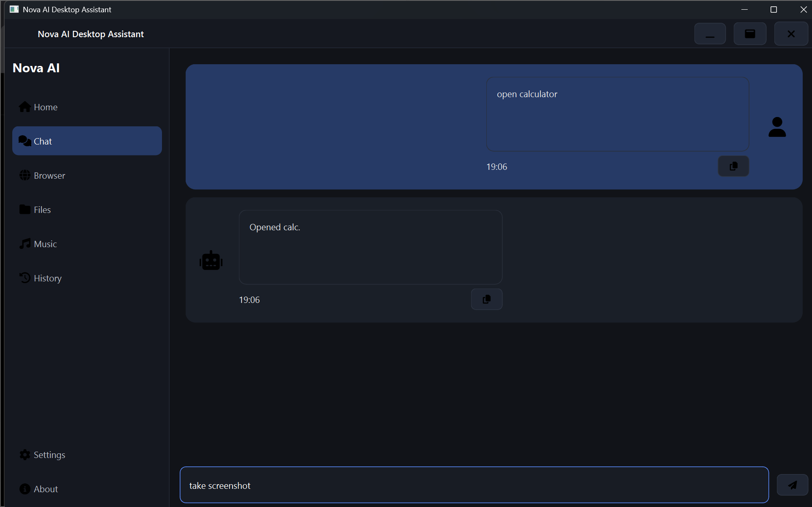

# 🚀 Nova AI: Voice-Controlled Desktop & Automation Assistant

[](https://www.python.org/)
[](https://pypi.org/project/PySide6/)
[](LICENSE)
[](https://github.com/openai/whisper)

Nova AI is a production-quality, low-latency desktop voice assistant built with **Python 3.13** and **PySide6 (Qt)** for Windows. It combines local speech-to-text (STT) and rule-based intent parsing with a highly resilient, redundant cloud completion router (Gemini + Groq fallbacks). 

By executing mechanical commands locally, Nova AI keeps operating system automation lag under 10ms, while seamlessly routing conversational queries to the cloud.

---

## 📸 Interface Preview

### Assistant Dashboard (Standby)

*Figure 1: Nova AI main standby dashboard featuring a custom-drawn mic visualizer and quick action pills.*

### Conversational Interface (Chats Page)

*Figure 2: Formatted chat bubble logs for user queries and router-completed answers.*

---

## ✨ Features

* **🎙️ Local Voice Control & Speech-to-Text**: High-fidelity local voice recording with auto-calibration and silence cutoff, transcribed locally using OpenAI's Whisper model (runs completely offline).
* **🔄 Redundant LLM Completions Router**: Primary conversational completion routes to Google Gemini. If rate limits (`429 Quota Exhausted`) or network outages occur, it automatically fallbacks to Groq (running Llama-3 completions).
* **🖥️ OS Desktop Automation**: Voice-control system volume, display brightness, screen captures, power configurations (sleep, lock, reboot, shutdown), and clipboard buffers.
* **📂 Local File Search**: An instant file-indexing service that maps user directories to a local database and searches filenames using fuzzy Levenshtein distance ranking.
* **🌐 Web & Media Control**: Search the web, visit sites, and playback YouTube videos or Spotify tracks via external browser integrations.
* **⚡ Responsive Threading Architecture**: Background workers handle all recording, transcription, and API requests, preventing PySide6 UI freezes.
* **🗣️ Subprocess-Isolated TTS**: Text-to-speech (SAPI5) runs inside isolated subprocesses, eliminating COM apartment deadlocks.

---

## 🛠️ Architecture

```
[User Voice Input]
       |
       v
[AudioRecorder] (Local Waveform Capture)
       |
       v
[SpeechTranscriber] (Local Whisper Base)
       |
       v
[AssistantBridge] (QThreadPool Orchestrator)
       |
       v
[CommandParser] (Local NLP Intent Classifier)
       |
       +----> Is Conversational? (Intent.AI_CHAT / UNKNOWN)
       |         |
       |         v
       |      [LLMRouter] ---> [Gemini API] --(Failover)--> [Groq API]
       |
       +----> Is System Automation? (e.g. Intent.OPEN_APP, Intent.SYSTEM_CONTROL)
                 |
                 v
              [ActionEngine] ---> Local Executables, Volume, CTypes, File Indexes
```

---

## 📂 Directory Layout

```
Nova-AI/
├── app/                  # Application source package
│   ├── audio/            # Audio recorders and SAPI5 speaking scripts
│   ├── browser/          # Web search and default browser launchers
│   ├── config/           # App global config and settings structures
│   ├── desktop/          # Local software and directory launchers
│   ├── files/            # Filesystem index database builders and fuzzy search engines
│   ├── llm/              # Provider-based Gemini + Groq multi-LLM router
│   ├── memory/           # Disk conversation history log serialization
│   ├── models/           # Shared data transfer classes (Command, Intent, Response)
│   ├── music/            # Youtube/Spotify player modules
│   ├── nlp/              # NLP processors (Intent classification and entity parsers)
│   ├── services/         # Background voice loops, bridge modules, and worker threads
│   ├── system/           # Low-level ctypes system controllers
│   ├── ui/               # Pages, custom widgets, styles (QSS), and thread managers
│   └── voice/            # Whisper speech transcriber integrations
├── config/               # persistent settings.json
├── data/                 # Indexed files cache and conversation logs
├── screenshots/          # App layout previews
└── test_ui.py            # Main application launcher entry point
```

---

## 🚀 Getting Started

### 📋 Prerequisites
* **Windows 10 / 11**
* **Python 3.13** (must be added to system PATH)
* **Microsoft C++ Build Tools** (needed to compile SoundDevice C bindings)

### 📥 Installation Steps
1. **Clone the repository**:
   ```bash
   git clone https://github.com/your-username/Nova-AI.git
   cd Nova-AI
   ```

2. **Create and activate a virtual environment**:
   ```bash
   python -m venv venv
   venv\Scripts\activate
   ```

3. **Install dependency libraries**:
   ```bash
   pip install -r requirements.txt
   ```

4. **Define Cloud API Keys**:
   Create a `.env` file in the root folder of the project:
   ```env
   GEMINI_API_KEY=your_gemini_api_key_here
   GROQ_API_KEY=your_groq_api_key_here
   ```

5. **Start the Assistant**:
   ```bash
   python test_ui.py
   ```

---

## ⚙️ Testing
To verify the SAPI5 speech synthesis output in isolation (confirming COM and process interfaces):
```bash
python scratch/test_subproc_sapi.py
```

---

## 📜 License
This project is licensed under the MIT License - see the [LICENSE](LICENSE) file for details.
